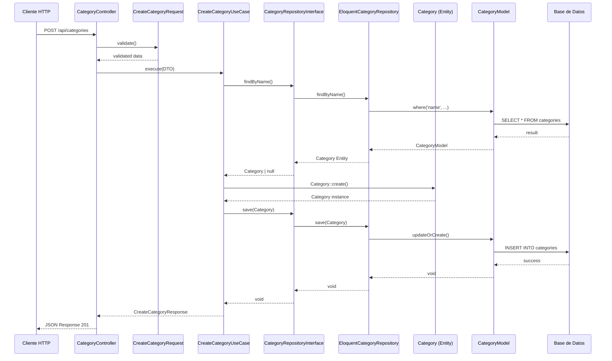

# Ejemplo Completo: Clean Architecture - Entidad Categories

Este documento muestra la estructura completa de todos los archivos creados para la entidad **Categories** siguiendo Clean Architecture.

## 📁 Estructura de Archivos Creados

```
app/
├── Domain/Category/                           [CAPA DE DOMINIO]
│   ├── Entities/
│   │   └── Category.php                       ✅ Entidad con lógica de negocio
│   └── ValueObjects/
│       └── CategoryName.php                   ✅ Value Object con validaciones
│
├── Domain/Shared/
│   └── ValueObjects/
│       └── Uuid.php                           ✅ Value Object compartido
│
├── Application/Category/                      [CAPA DE APLICACIÓN]
│   ├── Contracts/
│   │   └── CategoryRepositoryInterface.php    ✅ INTERFAZ del repositorio
│   └── UseCases/
│       ├── CreateCategory/
│       │   ├── CreateCategoryUseCase.php      ✅ CASO DE USO principal
│       │   ├── CreateCategoryDTO.php          ✅ DTO de entrada
│       │   └── CreateCategoryResponse.php     ✅ DTO de salida
│       └── GetCategories/
│           └── GetCategoriesUseCase.php       ✅ Caso de uso para consultas
│
├── Infrastructure/                            [CAPA DE INFRAESTRUCTURA]
│   ├── Persistence/Eloquent/
│   │   ├── Models/
│   │   │   └── CategoryModel.php              ✅ Modelo Eloquent (persistencia)
│   │   └── Repositories/
│   │       └── EloquentCategoryRepository.php ✅ IMPLEMENTACIÓN del repositorio
│   └── Laravel/Providers/
│       └── CategoryServiceProvider.php        ✅ Service Provider para DI
│
└── Presentation/API/Category/                 [CAPA DE PRESENTACIÓN]
    ├── Controllers/
    │   └── CategoryController.php             ✅ Controller HTTP (thin)
    ├── Requests/
    │   └── CreateCategoryRequest.php          ✅ Validación HTTP
    └── Resources/
        └── CategoryResource.php               ✅ Transformador JSON
```

---

## 🔄 Flujo de Datos (Request → Response)



---

## 📝 Resumen de Responsabilidades por Capa

### 🎯 Domain Layer
- **Category Entity**: Lógica de negocio, validaciones, métodos de dominio
- **CategoryName Value Object**: Validación del nombre con reglas de negocio
- **Uuid Value Object**: Identificador único con validación

**Características clave:**
- ❌ NO depende de Laravel
- ❌ NO sabe de bases de datos
- ❌ NO sabe de HTTP
- ✅ Solo lógica de negocio pura

---

### 🔧 Application Layer
- **CategoryRepositoryInterface**: Define QUÉ operaciones necesitamos (contrato)
- **CreateCategoryUseCase**: Orquesta la lógica para crear una categoría
- **GetCategoriesUseCase**: Orquesta la lógica para obtener categorías
- **DTOs**: Transportan datos entre capas

**Características clave:**
- ✅ Depende solo de Domain
- ❌ NO sabe CÓMO se implementa la persistencia
- ✅ Define contratos (interfaces) que otros implementarán

---

### 🏗️ Infrastructure Layer
- **CategoryModel**: Modelo Eloquent para persistencia
- **EloquentCategoryRepository**: IMPLEMENTA la interfaz usando Eloquent
- **CategoryServiceProvider**: Registra las dependencias

**Características clave:**
- ✅ Implementa las interfaces de Application
- ✅ Conoce Eloquent y Laravel
- ✅ Convierte entre Entity (Domain) ↔ Model (Eloquent)

---

### 🎨 Presentation Layer
- **CategoryController**: Recibe HTTP, llama Use Cases, retorna JSON
- **CreateCategoryRequest**: Valida la entrada HTTP
- **CategoryResource**: Formatea la salida JSON

**Características clave:**
- ✅ Depende de Application (usa los Use Cases)
- ✅ Conoce HTTP y Laravel
- ❌ NO contiene lógica de negocio (es THIN)

---

## 🔑 Conceptos Clave

### 1. Separación de Concerns

Cada capa tiene una responsabilidad clara y NO se mezcla con otras:

- **Domain** = Reglas de negocio
- **Application** = Casos de uso
- **Infrastructure** = Implementación técnica
- **Presentation** = Interfaz de usuario (API)

---

### 2. Dependency Inversion

Las dependencias apuntan HACIA ADENTRO:

```
Presentation → Application → Domain
     ↓              ↓
Infrastructure
```

**Nota importante**: Infrastructure implementa las interfaces de Application, pero Application NO conoce Infrastructure.

---

### 3. Interfaces vs Implementaciones

| Archivo | Tipo | Capa | Propósito |
|---------|------|------|-----------|
| `CategoryRepositoryInterface.php` | **INTERFAZ** (Contrato) | Application | Define QUÉ operaciones necesitamos |
| `EloquentCategoryRepository.php` | **IMPLEMENTACIÓN** | Infrastructure | Define CÓMO persistir con Eloquent |

**Ventajas:**
- ✅ Puedes cambiar de Eloquent a MongoDB sin tocar Application
- ✅ Puedes testear fácilmente con mocks
- ✅ El código de negocio no depende de detalles técnicos

---

### 4. Entity vs Model

| Concepto | Archivo | Capa | Propósito |
|----------|---------|------|-----------|
| **Entity** | `Category.php` | Domain | Lógica de negocio pura |
| **Model** | `CategoryModel.php` | Infrastructure | Persistencia con Eloquent |

**NO son lo mismo:**
- Entity = Reglas de negocio (Domain)
- Model = Herramienta de persistencia (Infrastructure)

---

### 5. Use Case (Caso de Uso)

Un Use Case orquesta una operación específica de la aplicación:

```php
CreateCategoryUseCase:
1. Validar que no exista el nombre
2. Validar que exista el padre (si aplica)
3. Crear la entidad del dominio
4. Persistir usando el repositorio
5. Retornar la respuesta
```

**Características:**
- ✅ Orquesta el flujo
- ✅ Usa el repositorio (interfaz)
- ❌ No sabe CÓMO se persiste
- ❌ No sabe de HTTP

---

## 🚀 Próximos Pasos

### 1. Configurar Composer Autoload

Actualiza `composer.json`:

```json
{
    "autoload": {
        "psr-4": {
            "App\\": "app/",
            "Domain\\": "app/Domain/",
            "Application\\": "app/Application/",
            "Infrastructure\\": "app/Infrastructure/",
            "Presentation\\": "app/Presentation/"
        }
    }
}
```

Luego ejecuta:
```bash
composer dump-autoload
```

---

### 2. Instalar ramsey/uuid

```bash
composer require ramsey/uuid
```

---

### 3. Registrar el Service Provider

En `bootstrap/providers.php`:

```php
return [
    App\Providers\AppServiceProvider::class,
    Infrastructure\Laravel\Providers\CategoryServiceProvider::class,
];
```

---

### 4. Configurar Rutas

En `routes/api.php`:

```php
use Presentation\API\Category\Controllers\CategoryController;

Route::prefix('categories')->group(function () {
    Route::get('/', [CategoryController::class, 'index']);
    Route::get('/root', [CategoryController::class, 'rootCategories']);
    Route::post('/', [CategoryController::class, 'store']);
});
```

---

### 5. Ejecutar Migración

```bash
php artisan migrate
```

---

## ✅ Ventajas de Esta Estructura

1. **Testeable**: Puedes testear cada capa independientemente
2. **Mantenible**: Código organizado y fácil de entender
3. **Escalable**: Fácil agregar nuevas features
4. **Flexible**: Puedes cambiar de tecnología sin dolor
5. **SOLID**: Cumple con todos los principios SOLID

---

## 📚 Resumen Final

Para cada entidad en Clean Architecture necesitas:

### ✅ Domain Layer
- [ ] **Entity** (ej: `Category.php`)
- [ ] **Value Objects** opcionales (ej: `CategoryName.php`)
- [ ] **Exceptions** opcionales del dominio

### ✅ Application Layer
- [ ] **Repository Interface** (ej: `CategoryRepositoryInterface.php`)
- [ ] **Use Cases** (ej: `CreateCategoryUseCase.php`)
- [ ] **DTOs** (ej: `CreateCategoryDTO.php`, `CreateCategoryResponse.php`)

### ✅ Infrastructure Layer
- [ ] **Eloquent Model** (ej: `CategoryModel.php`)
- [ ] **Repository Implementation** (ej: `EloquentCategoryRepository.php`)
- [ ] **Service Provider** (ej: `CategoryServiceProvider.php`)
- [ ] **Migration** (ej: `create_categories_table.php`)

### ✅ Presentation Layer
- [ ] **Controller** (ej: `CategoryController.php`)
- [ ] **Form Request** (ej: `CreateCategoryRequest.php`)
- [ ] **Resource** (ej: `CategoryResource.php`)

---

**¡Felicidades! Ahora tienes un módulo completo siguiendo Clean Architecture.** 🎉
