# Guía de Implementación de Clean Architecture en Laravel E-commerce API

## 📋 Tabla de Contenidos

1. [Introducción](#introducción)
2. [¿Qué es Clean Architecture?](#qué-es-clean-architecture)
3. [Principios Fundamentales](#principios-fundamentales)
4. [Estructura de Capas](#estructura-de-capas)
5. [Estructura de Carpetas Propuesta](#estructura-de-carpetas-propuesta)
6. [Implementación Paso a Paso](#implementación-paso-a-paso)
7. [Ejemplos Prácticos](#ejemplos-prácticos)
8. [Patrones de Diseño Recomendados](#patrones-de-diseño-recomendados)
9. [Testing](#testing)
10. [Mejores Prácticas](#mejores-prácticas)
11. [Migración del Proyecto Actual](#migración-del-proyecto-actual)

---

## Introducción

Esta guía proporciona un enfoque completo para implementar **Clean Architecture** en nuestro proyecto Laravel de E-commerce API. El objetivo es crear un código mantenible, testeable y escalable que sea independiente de frameworks y tecnologías específicas.

### ¿Por qué Clean Architecture?

- ✅ **Independencia de Frameworks**: El código de negocio no depende de Laravel
- ✅ **Testeable**: Las reglas de negocio pueden probarse sin UI, DB o servicios externos
- ✅ **Independencia de UI**: La lógica de negocio no conoce la interfaz
- ✅ **Independencia de Base de Datos**: Puedes cambiar de MySQL a PostgreSQL sin dolor
- ✅ **Independencia de Agentes Externos**: Las reglas de negocio no conocen nada del mundo exterior

---

## ¿Qué es Clean Architecture?

Clean Architecture es un enfoque arquitectónico propuesto por Robert C. Martin (Uncle Bob) que organiza el código en capas circulares, donde las dependencias apuntan hacia adentro, hacia las reglas de negocio.

```mermaid
graph TB
    subgraph "Capa Externa - Frameworks & Drivers"
        A[Controllers]
        B[Database]
        C[External APIs]
    end
    
    subgraph "Capa de Interfaz - Interface Adapters"
        D[Presenters]
        E[Repositories]
        F[Gateways]
    end
    
    subgraph "Capa de Aplicación - Use Cases"
        G[Use Cases / Interactors]
        H[Input Ports]
        I[Output Ports]
    end
    
    subgraph "Capa de Dominio - Entities"
        J[Entities]
        K[Business Rules]
        L[Value Objects]
    end
    
    A --> D
    B --> E
    C --> F
    D --> G
    E --> G
    F --> G
    G --> J
    G --> K
    G --> L
```



---

## Principios Fundamentales

### 1. **Dependency Rule (Regla de Dependencia)**

> Las dependencias del código fuente solo pueden apuntar hacia adentro. Nada en un círculo interior puede saber absolutamente nada sobre algo en un círculo exterior.

### 2. **SOLID Principles**

- **S**ingle Responsibility Principle
- **O**pen/Closed Principle
- **L**iskov Substitution Principle
- **I**nterface Segregation Principle
- **D**ependency Inversion Principle

### 3. **Separation of Concerns**

Cada capa tiene una responsabilidad específica y no debe mezclarse con otras.

---

## Estructura de Capas

### 1. **Domain Layer (Capa de Dominio)** 🎯

**Responsabilidad**: Contiene las reglas de negocio empresariales.

**Componentes**:
- **Entities**: Objetos de negocio con identidad única
- **Value Objects**: Objetos inmutables sin identidad
- **Domain Events**: Eventos que ocurren en el dominio
- **Domain Services**: Lógica de negocio que no pertenece a una entidad específica
- **Exceptions**: Excepciones del dominio

**Características**:
- ❌ No depende de ninguna otra capa
- ❌ No conoce frameworks
- ❌ No conoce bases de datos
- ✅ Código puro de PHP
- ✅ 100% testeable

---

### 2. **Application Layer (Capa de Aplicación)** 🔧

**Responsabilidad**: Orquesta el flujo de datos hacia y desde las entidades del dominio.

**Componentes**:
- **Use Cases (Interactors)**: Casos de uso de la aplicación
- **DTOs (Data Transfer Objects)**: Objetos para transferir datos entre capas
- **Interfaces/Contracts**: Contratos que implementarán las capas externas
- **Application Services**: Servicios de aplicación

**Características**:
- ✅ Depende solo de la capa de dominio
- ❌ No conoce detalles de implementación (DB, UI, etc.)
- ✅ Define interfaces que implementarán las capas externas

---

### 3. **Infrastructure Layer (Capa de Infraestructura)** 🏗️

**Responsabilidad**: Implementa los detalles técnicos y se comunica con servicios externos.

**Componentes**:
- **Repositories**: Implementación de persistencia
- **External Services**: APIs externas, servicios de pago, etc.
- **Database**: Migraciones, seeders, query builders
- **File System**: Almacenamiento de archivos
- **Email Services**: Envío de correos

**Características**:
- ✅ Implementa las interfaces definidas en Application Layer
- ✅ Conoce frameworks y librerías
- ✅ Se comunica con bases de datos y APIs externas

---

### 4. **Presentation Layer (Capa de Presentación)** 🎨

**Responsabilidad**: Maneja la entrada del usuario y presenta la salida.

**Componentes**:
- **Controllers**: Controladores HTTP
- **Resources**: Transformadores de respuesta (API Resources)
- **Requests**: Validación de entrada (Form Requests)
- **Middleware**: Middleware de Laravel
- **View Models**: Modelos para vistas

**Características**:
- ✅ Depende de Application Layer
- ✅ Conoce el framework (Laravel)
- ✅ Maneja HTTP, routing, validación

---

## Estructura de Carpetas Propuesta

```
app/
├── Domain/                           # Capa de Dominio
│   ├── Product/                      # Bounded Context: Productos
│   │   ├── Entities/
│   │   │   └── Product.php
│   │   ├── ValueObjects/
│   │   │   ├── ProductName.php
│   │   │   ├── Price.php
│   │   │   └── SKU.php
│   │   ├── Events/
│   │   │   └── ProductCreated.php
│   │   ├── Exceptions/
│   │   │   └── InvalidPriceException.php
│   │   └── Services/
│   │       └── ProductPricingService.php
│   │
│   ├── Order/                        # Bounded Context: Órdenes
│   │   ├── Entities/
│   │   │   ├── Order.php
│   │   │   └── OrderItem.php
│   │   ├── ValueObjects/
│   │   │   ├── OrderNumber.php
│   │   │   └── OrderStatus.php
│   │   ├── Events/
│   │   │   ├── OrderPlaced.php
│   │   │   └── OrderShipped.php
│   │   └── Exceptions/
│   │       └── OrderNotFoundException.php
│   │
│   ├── Customer/                     # Bounded Context: Clientes
│   │   ├── Entities/
│   │   │   └── Customer.php
│   │   ├── ValueObjects/
│   │   │   ├── Email.php
│   │   │   └── Address.php
│   │   └── Events/
│   │       └── CustomerRegistered.php
│   │
│   └── Shared/                       # Elementos compartidos
│       ├── ValueObjects/
│       │   ├── Money.php
│       │   └── Uuid.php
│       └── Exceptions/
│           └── DomainException.php
│
├── Application/                      # Capa de Aplicación
│   ├── Product/
│   │   ├── UseCases/
│   │   │   ├── CreateProduct/
│   │   │   │   ├── CreateProductUseCase.php
│   │   │   │   ├── CreateProductDTO.php
│   │   │   │   └── CreateProductResponse.php
│   │   │   ├── UpdateProduct/
│   │   │   │   └── UpdateProductUseCase.php
│   │   │   ├── DeleteProduct/
│   │   │   │   └── DeleteProductUseCase.php
│   │   │   └── GetProduct/
│   │   │       └── GetProductUseCase.php
│   │   └── Contracts/
│   │       ├── ProductRepositoryInterface.php
│   │       └── ProductImageStorageInterface.php
│   │
│   ├── Order/
│   │   ├── UseCases/
│   │   │   ├── PlaceOrder/
│   │   │   │   ├── PlaceOrderUseCase.php
│   │   │   │   └── PlaceOrderDTO.php
│   │   │   ├── CancelOrder/
│   │   │   │   └── CancelOrderUseCase.php
│   │   │   └── GetOrderDetails/
│   │   │       └── GetOrderDetailsUseCase.php
│   │   └── Contracts/
│   │       ├── OrderRepositoryInterface.php
│   │       └── PaymentGatewayInterface.php
│   │
│   ├── Customer/
│   │   ├── UseCases/
│   │   │   ├── RegisterCustomer/
│   │   │   │   └── RegisterCustomerUseCase.php
│   │   │   └── UpdateCustomerProfile/
│   │   │       └── UpdateCustomerProfileUseCase.php
│   │   └── Contracts/
│   │       └── CustomerRepositoryInterface.php
│   │
│   └── Shared/
│       ├── DTOs/
│       └── Contracts/
│           └── UnitOfWorkInterface.php
│
├── Infrastructure/                   # Capa de Infraestructura
│   ├── Persistence/
│   │   ├── Eloquent/
│   │   │   ├── Models/
│   │   │   │   ├── ProductModel.php
│   │   │   │   ├── OrderModel.php
│   │   │   │   └── CustomerModel.php
│   │   │   └── Repositories/
│   │   │       ├── EloquentProductRepository.php
│   │   │       ├── EloquentOrderRepository.php
│   │   │       └── EloquentCustomerRepository.php
│   │   └── Redis/
│   │       └── RedisCacheRepository.php
│   │
│   ├── External/
│   │   ├── Payment/
│   │   │   ├── StripePaymentGateway.php
│   │   │   └── PayPalPaymentGateway.php
│   │   ├── Email/
│   │   │   └── SendGridEmailService.php
│   │   └── Storage/
│   │       └── S3ImageStorage.php
│   │
│   └── Laravel/
│       └── Providers/
│           ├── RepositoryServiceProvider.php
│           └── UseCaseServiceProvider.php
│
└── Presentation/                     # Capa de Presentación
    ├── API/
    │   ├── Product/
    │   │   ├── Controllers/
    │   │   │   └── ProductController.php
    │   │   ├── Requests/
    │   │   │   ├── CreateProductRequest.php
    │   │   │   └── UpdateProductRequest.php
    │   │   └── Resources/
    │   │       └── ProductResource.php
    │   │
    │   ├── Order/
    │   │   ├── Controllers/
    │   │   │   └── OrderController.php
    │   │   ├── Requests/
    │   │   │   └── PlaceOrderRequest.php
    │   │   └── Resources/
    │   │       ├── OrderResource.php
    │   │       └── OrderItemResource.php
    │   │
    │   └── Customer/
    │       ├── Controllers/
    │       │   └── CustomerController.php
    │       ├── Requests/
    │       │   └── RegisterCustomerRequest.php
    │       └── Resources/
    │           └── CustomerResource.php
    │
    └── Shared/
        ├── Middleware/
        └── Exceptions/
            └── Handler.php
```

---

## Implementación Paso a Paso

### Paso 1: Configurar PSR-4 Autoloading

Actualiza `composer.json`:

```json
{
    "autoload": {
        "psr-4": {
            "App\\": "app/",
            "Domain\\": "app/Domain/",
            "Application\\": "app/Application/",
            "Infrastructure\\": "app/Infrastructure/",
            "Presentation\\": "app/Presentation/"
        }
    }
}
```

Ejecuta:
```bash
composer dump-autoload
```

---

### Paso 2: Crear Estructura de Carpetas

```bash
# Domain Layer
mkdir -p app/Domain/{Product,Order,Customer,Shared}/{Entities,ValueObjects,Events,Exceptions,Services}

# Application Layer
mkdir -p app/Application/{Product,Order,Customer,Shared}/{UseCases,Contracts,DTOs}

# Infrastructure Layer
mkdir -p app/Infrastructure/Persistence/{Eloquent/{Models,Repositories},Redis}
mkdir -p app/Infrastructure/External/{Payment,Email,Storage}
mkdir -p app/Infrastructure/Laravel/Providers

# Presentation Layer
mkdir -p app/Presentation/API/{Product,Order,Customer}/{Controllers,Requests,Resources}
mkdir -p app/Presentation/Shared/{Middleware,Exceptions}
```

---

### Paso 3: Implementar Domain Entities

**Características de las Entidades del Dominio**:
- Tienen identidad única
- Contienen reglas de negocio
- Son independientes del framework
- No extienden de Eloquent Model

---

### Paso 4: Definir Contratos/Interfaces

Define las interfaces en la capa de aplicación que serán implementadas por la infraestructura.

---

### Paso 5: Implementar Use Cases

Los casos de uso orquestan la lógica de negocio y no conocen detalles de implementación.

---

### Paso 6: Implementar Infraestructura

Implementa los repositorios, servicios externos y cualquier detalle técnico.

---

### Paso 7: Configurar Dependency Injection

Crea Service Providers para registrar las implementaciones.

---

### Paso 8: Implementar Controllers

Los controllers son delgados y solo coordinan entre la entrada HTTP y los Use Cases.

---

## Ejemplos Prácticos

### Ejemplo 1: Entity - Product

```php
<?php

declare(strict_types=1);

namespace Domain\Product\Entities;

use Domain\Product\ValueObjects\Price;
use Domain\Product\ValueObjects\ProductName;
use Domain\Product\ValueObjects\SKU;
use Domain\Product\Exceptions\InvalidPriceException;
use Domain\Shared\ValueObjects\Uuid;

final class Product
{
    private function __construct(
        private readonly Uuid $id,
        private ProductName $name,
        private Price $price,
        private readonly SKU $sku,
        private string $description,
        private int $stock,
        private bool $isActive
    ) {
        $this->validateStock();
    }

    public static function create(
        ProductName $name,
        Price $price,
        SKU $sku,
        string $description,
        int $stock
    ): self {
        return new self(
            id: Uuid::generate(),
            name: $name,
            price: $price,
            sku: $sku,
            description: $description,
            stock: $stock,
            isActive: true
        );
    }

    public static function fromPrimitives(
        string $id,
        string $name,
        float $price,
        string $currency,
        string $sku,
        string $description,
        int $stock,
        bool $isActive
    ): self {
        return new self(
            id: Uuid::fromString($id),
            name: new ProductName($name),
            price: new Price($price, $currency),
            sku: new SKU($sku),
            description: $description,
            stock: $stock,
            isActive: $isActive
        );
    }

    public function updatePrice(Price $newPrice): void
    {
        if ($newPrice->isLowerThan($this->price)) {
            // Domain Event: PriceReduced
        }
        
        $this->price = $newPrice;
    }

    public function decreaseStock(int $quantity): void
    {
        if ($this->stock < $quantity) {
            throw new InvalidPriceException('Insufficient stock');
        }
        
        $this->stock -= $quantity;
        
        if ($this->stock === 0) {
            // Domain Event: ProductOutOfStock
        }
    }

    public function increaseStock(int $quantity): void
    {
        $this->stock += $quantity;
    }

    public function activate(): void
    {
        $this->isActive = true;
    }

    public function deactivate(): void
    {
        $this->isActive = false;
    }

    private function validateStock(): void
    {
        if ($this->stock < 0) {
            throw new InvalidPriceException('Stock cannot be negative');
        }
    }

    // Getters
    public function id(): Uuid
    {
        return $this->id;
    }

    public function name(): ProductName
    {
        return $this->name;
    }

    public function price(): Price
    {
        return $this->price;
    }

    public function sku(): SKU
    {
        return $this->sku;
    }

    public function description(): string
    {
        return $this->description;
    }

    public function stock(): int
    {
        return $this->stock;
    }

    public function isActive(): bool
    {
        return $this->isActive;
    }
}
```

---

### Ejemplo 2: Value Object - Price

```php
<?php

declare(strict_types=1);

namespace Domain\Product\ValueObjects;

use Domain\Product\Exceptions\InvalidPriceException;

final readonly class Price
{
    private const SUPPORTED_CURRENCIES = ['USD', 'EUR', 'GBP', 'MXN'];

    public function __construct(
        private float $amount,
        private string $currency
    ) {
        $this->validate();
    }

    private function validate(): void
    {
        if ($this->amount < 0) {
            throw new InvalidPriceException('Price cannot be negative');
        }

        if (!in_array($this->currency, self::SUPPORTED_CURRENCIES, true)) {
            throw new InvalidPriceException(
                sprintf('Currency %s is not supported', $this->currency)
            );
        }
    }

    public function amount(): float
    {
        return $this->amount;
    }

    public function currency(): string
    {
        return $this->currency;
    }

    public function isLowerThan(Price $other): bool
    {
        $this->ensureSameCurrency($other);
        return $this->amount < $other->amount;
    }

    public function isGreaterThan(Price $other): bool
    {
        $this->ensureSameCurrency($other);
        return $this->amount > $other->amount;
    }

    public function add(Price $other): self
    {
        $this->ensureSameCurrency($other);
        return new self($this->amount + $other->amount, $this->currency);
    }

    public function subtract(Price $other): self
    {
        $this->ensureSameCurrency($other);
        return new self($this->amount - $other->amount, $this->currency);
    }

    public function multiply(float $multiplier): self
    {
        return new self($this->amount * $multiplier, $this->currency);
    }

    public function applyDiscount(float $percentage): self
    {
        if ($percentage < 0 || $percentage > 100) {
            throw new InvalidPriceException('Discount percentage must be between 0 and 100');
        }

        $discountAmount = $this->amount * ($percentage / 100);
        return new self($this->amount - $discountAmount, $this->currency);
    }

    public function format(): string
    {
        return sprintf('%s %.2f', $this->currency, $this->amount);
    }

    public function equals(Price $other): bool
    {
        return $this->amount === $other->amount 
            && $this->currency === $other->currency;
    }

    private function ensureSameCurrency(Price $other): void
    {
        if ($this->currency !== $other->currency) {
            throw new InvalidPriceException('Cannot operate on different currencies');
        }
    }
}
```

---

### Ejemplo 3: Repository Interface

```php
<?php

declare(strict_types=1);

namespace Application\Product\Contracts;

use Domain\Product\Entities\Product;
use Domain\Product\ValueObjects\SKU;
use Domain\Shared\ValueObjects\Uuid;

interface ProductRepositoryInterface
{
    public function save(Product $product): void;
    
    public function findById(Uuid $id): ?Product;
    
    public function findBySKU(SKU $sku): ?Product;
    
    public function findAll(int $page = 1, int $perPage = 15): array;
    
    public function findActiveProducts(int $page = 1, int $perPage = 15): array;
    
    public function delete(Uuid $id): void;
    
    public function exists(Uuid $id): bool;
}
```

---

### Ejemplo 4: Use Case - CreateProduct

```php
<?php

declare(strict_types=1);

namespace Application\Product\UseCases\CreateProduct;

use Application\Product\Contracts\ProductRepositoryInterface;
use Domain\Product\Entities\Product;
use Domain\Product\ValueObjects\Price;
use Domain\Product\ValueObjects\ProductName;
use Domain\Product\ValueObjects\SKU;

final readonly class CreateProductUseCase
{
    public function __construct(
        private ProductRepositoryInterface $productRepository
    ) {}

    public function execute(CreateProductDTO $dto): CreateProductResponse
    {
        // Validate SKU uniqueness
        if ($this->productRepository->findBySKU(new SKU($dto->sku)) !== null) {
            throw new \DomainException('Product with this SKU already exists');
        }

        // Create domain entity
        $product = Product::create(
            name: new ProductName($dto->name),
            price: new Price($dto->price, $dto->currency),
            sku: new SKU($dto->sku),
            description: $dto->description,
            stock: $dto->stock
        );

        // Persist
        $this->productRepository->save($product);

        // Return response
        return new CreateProductResponse(
            id: $product->id()->value(),
            name: $product->name()->value(),
            price: $product->price()->amount(),
            currency: $product->price()->currency(),
            sku: $product->sku()->value(),
            description: $product->description(),
            stock: $product->stock(),
            isActive: $product->isActive()
        );
    }
}
```

---

### Ejemplo 5: DTO - CreateProductDTO

```php
<?php

declare(strict_types=1);

namespace Application\Product\UseCases\CreateProduct;

final readonly class CreateProductDTO
{
    public function __construct(
        public string $name,
        public float $price,
        public string $currency,
        public string $sku,
        public string $description,
        public int $stock
    ) {}

    public static function fromArray(array $data): self
    {
        return new self(
            name: $data['name'],
            price: (float) $data['price'],
            currency: $data['currency'] ?? 'USD',
            sku: $data['sku'],
            description: $data['description'] ?? '',
            stock: (int) ($data['stock'] ?? 0)
        );
    }
}
```

---

### Ejemplo 6: Repository Implementation - EloquentProductRepository

```php
<?php

declare(strict_types=1);

namespace Infrastructure\Persistence\Eloquent\Repositories;

use Application\Product\Contracts\ProductRepositoryInterface;
use Domain\Product\Entities\Product;
use Domain\Product\ValueObjects\Price;
use Domain\Product\ValueObjects\ProductName;
use Domain\Product\ValueObjects\SKU;
use Domain\Shared\ValueObjects\Uuid;
use Infrastructure\Persistence\Eloquent\Models\ProductModel;

final class EloquentProductRepository implements ProductRepositoryInterface
{
    public function save(Product $product): void
    {
        ProductModel::updateOrCreate(
            ['id' => $product->id()->value()],
            [
                'name' => $product->name()->value(),
                'price' => $product->price()->amount(),
                'currency' => $product->price()->currency(),
                'sku' => $product->sku()->value(),
                'description' => $product->description(),
                'stock' => $product->stock(),
                'is_active' => $product->isActive(),
            ]
        );
    }

    public function findById(Uuid $id): ?Product
    {
        $model = ProductModel::find($id->value());

        return $model ? $this->toDomain($model) : null;
    }

    public function findBySKU(SKU $sku): ?Product
    {
        $model = ProductModel::where('sku', $sku->value())->first();

        return $model ? $this->toDomain($model) : null;
    }

    public function findAll(int $page = 1, int $perPage = 15): array
    {
        return ProductModel::query()
            ->paginate($perPage, ['*'], 'page', $page)
            ->items();
    }

    public function findActiveProducts(int $page = 1, int $perPage = 15): array
    {
        return ProductModel::where('is_active', true)
            ->paginate($perPage, ['*'], 'page', $page)
            ->items();
    }

    public function delete(Uuid $id): void
    {
        ProductModel::destroy($id->value());
    }

    public function exists(Uuid $id): bool
    {
        return ProductModel::where('id', $id->value())->exists();
    }

    private function toDomain(ProductModel $model): Product
    {
        return Product::fromPrimitives(
            id: $model->id,
            name: $model->name,
            price: $model->price,
            currency: $model->currency,
            sku: $model->sku,
            description: $model->description,
            stock: $model->stock,
            isActive: $model->is_active
        );
    }
}
```

---

### Ejemplo 7: Controller

```php
<?php

declare(strict_types=1);

namespace Presentation\API\Product\Controllers;

use Application\Product\UseCases\CreateProduct\CreateProductDTO;
use Application\Product\UseCases\CreateProduct\CreateProductUseCase;
use Illuminate\Http\JsonResponse;
use Presentation\API\Product\Requests\CreateProductRequest;
use Presentation\API\Product\Resources\ProductResource;

final class ProductController
{
    public function __construct(
        private readonly CreateProductUseCase $createProductUseCase
    ) {}

    public function store(CreateProductRequest $request): JsonResponse
    {
        $dto = CreateProductDTO::fromArray($request->validated());
        
        $response = $this->createProductUseCase->execute($dto);

        return response()->json([
            'data' => new ProductResource($response),
            'message' => 'Product created successfully'
        ], 201);
    }
}
```

---

### Ejemplo 8: Service Provider

```php
<?php

declare(strict_types=1);

namespace Infrastructure\Laravel\Providers;

use Application\Product\Contracts\ProductRepositoryInterface;
use Infrastructure\Persistence\Eloquent\Repositories\EloquentProductRepository;
use Illuminate\Support\ServiceProvider;

final class RepositoryServiceProvider extends ServiceProvider
{
    public function register(): void
    {
        // Product
        $this->app->bind(
            ProductRepositoryInterface::class,
            EloquentProductRepository::class
        );

        // Add more repository bindings here...
    }
}
```

Registra el provider en `bootstrap/providers.php`:

```php
return [
    App\Providers\AppServiceProvider::class,
    Infrastructure\Laravel\Providers\RepositoryServiceProvider::class,
];
```

---

## Patrones de Diseño Recomendados

### 1. **Repository Pattern** ✅

Ya implementado en los ejemplos anteriores. Abstrae la capa de persistencia.

---

### 2. **Unit of Work Pattern**

Agrupa múltiples operaciones en una sola transacción.

```php
<?php

namespace Application\Shared\Contracts;

interface UnitOfWorkInterface
{
    public function beginTransaction(): void;
    public function commit(): void;
    public function rollback(): void;
}
```

---

### 3. **Factory Pattern**

```php
<?php

namespace Domain\Product\Factories;

use Domain\Product\Entities\Product;
use Domain\Product\ValueObjects\Price;
use Domain\Product\ValueObjects\ProductName;
use Domain\Product\ValueObjects\SKU;

final class ProductFactory
{
    public static function createFromArray(array $data): Product
    {
        return Product::create(
            name: new ProductName($data['name']),
            price: new Price($data['price'], $data['currency']),
            sku: new SKU($data['sku']),
            description: $data['description'],
            stock: $data['stock']
        );
    }
}
```

---

### 4. **Strategy Pattern**

Para diferentes estrategias de pago:

```php
<?php

namespace Application\Order\Contracts;

use Domain\Order\Entities\Order;

interface PaymentGatewayInterface
{
    public function charge(Order $order): bool;
    public function refund(string $transactionId, float $amount): bool;
}
```

Implementaciones:

```php
// Infrastructure/External/Payment/StripePaymentGateway.php
// Infrastructure/External/Payment/PayPalPaymentGateway.php
```

---

### 5. **Specification Pattern**

Para queries complejas:

```php
<?php

namespace Domain\Product\Specifications;

use Domain\Product\Entities\Product;

interface ProductSpecificationInterface
{
    public function isSatisfiedBy(Product $product): bool;
}

final class ActiveProductSpecification implements ProductSpecificationInterface
{
    public function isSatisfiedBy(Product $product): bool
    {
        return $product->isActive();
    }
}
```

---

## Testing

### Unit Tests - Domain Layer

```php
<?php

namespace Tests\Unit\Domain\Product;

use Domain\Product\Entities\Product;
use Domain\Product\ValueObjects\Price;
use Domain\Product\ValueObjects\ProductName;
use Domain\Product\ValueObjects\SKU;
use PHPUnit\Framework\TestCase;

final class ProductTest extends TestCase
{
    public function test_can_create_product(): void
    {
        $product = Product::create(
            name: new ProductName('Test Product'),
            price: new Price(99.99, 'USD'),
            sku: new SKU('TEST-001'),
            description: 'Test description',
            stock: 10
        );

        $this->assertInstanceOf(Product::class, $product);
        $this->assertEquals('Test Product', $product->name()->value());
        $this->assertEquals(99.99, $product->price()->amount());
        $this->assertEquals(10, $product->stock());
        $this->assertTrue($product->isActive());
    }

    public function test_can_decrease_stock(): void
    {
        $product = Product::create(
            name: new ProductName('Test Product'),
            price: new Price(99.99, 'USD'),
            sku: new SKU('TEST-001'),
            description: 'Test description',
            stock: 10
        );

        $product->decreaseStock(5);

        $this->assertEquals(5, $product->stock());
    }

    public function test_cannot_decrease_stock_below_zero(): void
    {
        $this->expectException(\DomainException::class);

        $product = Product::create(
            name: new ProductName('Test Product'),
            price: new Price(99.99, 'USD'),
            sku: new SKU('TEST-001'),
            description: 'Test description',
            stock: 5
        );

        $product->decreaseStock(10);
    }
}
```

---

### Integration Tests - Use Cases

```php
<?php

namespace Tests\Feature\Application\Product;

use Application\Product\Contracts\ProductRepositoryInterface;
use Application\Product\UseCases\CreateProduct\CreateProductDTO;
use Application\Product\UseCases\CreateProduct\CreateProductUseCase;
use Tests\TestCase;

final class CreateProductUseCaseTest extends TestCase
{
    private ProductRepositoryInterface $repository;
    private CreateProductUseCase $useCase;

    protected function setUp(): void
    {
        parent::setUp();
        
        $this->repository = $this->app->make(ProductRepositoryInterface::class);
        $this->useCase = new CreateProductUseCase($this->repository);
    }

    public function test_can_create_product(): void
    {
        $dto = new CreateProductDTO(
            name: 'Test Product',
            price: 99.99,
            currency: 'USD',
            sku: 'TEST-001',
            description: 'Test description',
            stock: 10
        );

        $response = $this->useCase->execute($dto);

        $this->assertNotNull($response->id);
        $this->assertEquals('Test Product', $response->name);
        $this->assertEquals(99.99, $response->price);
    }
}
```

---

## Mejores Prácticas

### 1. **Naming Conventions**

- **Entities**: Sustantivos (Product, Order, Customer)
- **Value Objects**: Sustantivos descriptivos (Price, Email, Address)
- **Use Cases**: Verbo + Sustantivo (CreateProduct, PlaceOrder)
- **Repositories**: Sustantivo + Repository (ProductRepository)
- **Controllers**: Sustantivo + Controller (ProductController)

---

### 2. **Evitar Anemic Domain Model**

❌ **Mal**:
```php
class Product
{
    public string $name;
    public float $price;
    
    // Solo getters y setters
}
```

✅ **Bien**:
```php
class Product
{
    // Comportamiento rico con lógica de negocio
    public function applyDiscount(float $percentage): void
    {
        // Validación y lógica
    }
}
```

---

### 3. **Usa Value Objects para Primitivos Importantes**

En lugar de usar strings o floats directamente, encapsula en Value Objects.

❌ **Mal**:
```php
function createProduct(string $email, float $price) { }
```

✅ **Bien**:
```php
function createProduct(Email $email, Price $price) { }
```

---

### 4. **Inyección de Dependencias**

Siempre usa interfaces y dependency injection.

❌ **Mal**:
```php
class CreateProductUseCase
{
    public function execute()
    {
        $repo = new EloquentProductRepository();
    }
}
```

✅ **Bien**:
```php
class CreateProductUseCase
{
    public function __construct(
        private ProductRepositoryInterface $repository
    ) {}
}
```

---

### 5. **Domain Events**

Usa eventos del dominio para side effects.

```php
<?php

namespace Domain\Product\Events;

final readonly class ProductCreated
{
    public function __construct(
        public string $productId,
        public string $productName,
        public float $price
    ) {}
}
```

---

### 6. **Fail Fast**

Valida en el constructor de Value Objects y Entities.

```php
class Email
{
    public function __construct(private string $value)
    {
        if (!filter_var($value, FILTER_VALIDATE_EMAIL)) {
            throw new InvalidEmailException();
        }
    }
}
```

---

### 7. **Immutability**

Usa `readonly` en Value Objects para hacerlos inmutables.

```php
final readonly class Price
{
    public function __construct(
        private float $amount,
        private string $currency
    ) {}
}
```

---

## Migración del Proyecto Actual

### Estrategia de Migración Incremental

> [!IMPORTANT]
> No migres todo de una vez. Hazlo de forma incremental por bounded context.

### Fase 1: Preparación (Semana 1)

- [ ] Crear la estructura de carpetas
- [ ] Configurar PSR-4 autoloading
- [ ] Crear Service Providers
- [ ] Documentar la arquitectura actual

---

### Fase 2: Migrar Módulo de Productos (Semana 2-3)

1. **Domain Layer**:
   - [ ] Crear `Product` entity
   - [ ] Crear Value Objects (Price, SKU, ProductName)
   - [ ] Crear Domain Exceptions

2. **Application Layer**:
   - [ ] Crear `ProductRepositoryInterface`
   - [ ] Crear Use Cases (CreateProduct, UpdateProduct, etc.)
   - [ ] Crear DTOs

3. **Infrastructure Layer**:
   - [ ] Implementar `EloquentProductRepository`
   - [ ] Migrar Eloquent Models a carpeta Infrastructure

4. **Presentation Layer**:
   - [ ] Refactorizar Controllers (hacerlos thin)
   - [ ] Crear Form Requests
   - [ ] Crear API Resources

---

### Fase 3: Migrar Módulo de Órdenes (Semana 4-5)

Repetir el mismo proceso para Orders.

---

### Fase 4: Migrar Módulo de Clientes (Semana 6)

Repetir el mismo proceso para Customers.

---

### Fase 5: Testing y Refinamiento (Semana 7-8)

- [ ] Escribir tests unitarios para Domain
- [ ] Escribir tests de integración para Use Cases
- [ ] Escribir tests de API
- [ ] Refactorizar código duplicado
- [ ] Documentar

---

## Checklist de Implementación

### ✅ Domain Layer
- [ ] Entities definidas con lógica de negocio
- [ ] Value Objects inmutables
- [ ] Domain Events
- [ ] Domain Exceptions personalizadas
- [ ] Domain Services cuando sea necesario

### ✅ Application Layer
- [ ] Interfaces/Contracts definidos
- [ ] Use Cases implementados
- [ ] DTOs para transfer de datos
- [ ] Application Services

### ✅ Infrastructure Layer
- [ ] Repositories implementados
- [ ] Eloquent Models en Infrastructure
- [ ] Implementaciones de servicios externos
- [ ] Service Providers configurados

### ✅ Presentation Layer
- [ ] Controllers thin (delgados)
- [ ] Form Requests para validación
- [ ] API Resources para respuestas
- [ ] Rutas organizadas

### ✅ Testing
- [ ] Tests unitarios de Domain
- [ ] Tests de Use Cases
- [ ] Tests de Repositories
- [ ] Tests de API endpoints

### ✅ Documentación
- [ ] README actualizado
- [ ] Documentación de arquitectura
- [ ] Diagramas de flujo
- [ ] Guías para desarrolladores

---

## Recursos Adicionales

### 📚 Libros
- **Clean Architecture** - Robert C. Martin
- **Domain-Driven Design** - Eric Evans
- **Implementing Domain-Driven Design** - Vaughn Vernon

### 🎥 Videos
- [Clean Architecture en Laravel](https://www.youtube.com/results?search_query=clean+architecture+laravel)
- [DDD en PHP](https://www.youtube.com/results?search_query=domain+driven+design+php)

### 🔗 Links
- [Laravel Beyond CRUD](https://laravel-beyond-crud.com/)
- [Clean Architecture Blog](https://blog.cleancoder.com/)

---

## Conclusión

La implementación de Clean Architecture en Laravel requiere disciplina y un cambio de mentalidad, pero los beneficios son enormes:

- ✅ Código más mantenible
- ✅ Mayor facilidad para testing
- ✅ Flexibilidad para cambiar tecnologías
- ✅ Mejor organización del equipo
- ✅ Escalabilidad a largo plazo

> [!TIP]
> Comienza pequeño, migra un módulo a la vez, y aprende en el camino. No necesitas perfección desde el inicio.

---

**¿Preguntas? ¿Dudas?**

Este documento es una guía viva. Actualízalo conforme aprendas y adaptes Clean Architecture a las necesidades específicas de tu proyecto.

¡Buena suerte con la implementación! 🚀
